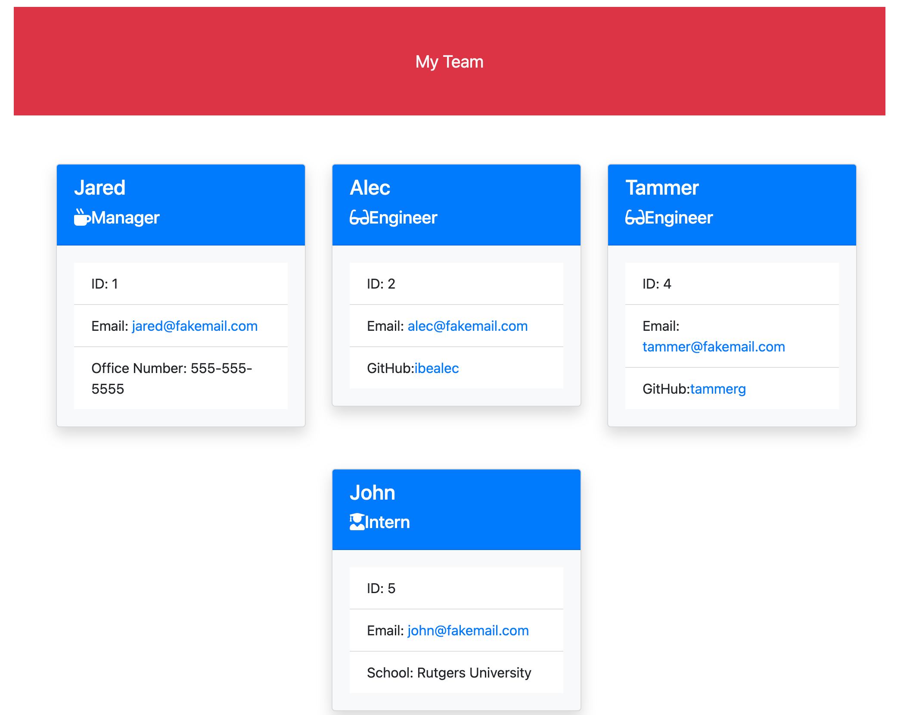

# friendly-team-profiles

## Description
I used node.js to create a command-line applciation that gathers information about employees and then displays that info on a generated a HTML webpage. 

Once a user runs the "node index.js" command, the user must input the team manager's name, ID, email, and office number. After this, the user is given the choice to quit the program or continue on inputting information regarding engineers and interns. If the user quits, the HTML is generated. If the user decides to input information regarding the engineers, the user will be prompted to input the engineer's name, ID, email, and GitHub username. Again, the user will be given the choice to finish (upon which an HTML will be created) or continue on adding engineers/interns. If the user decides to input information about the interns, the user will be prompted to input the intern's name, ID, email, and school. The process can repeat until the user finishes the program. 

Once the HTML file is generated, the user will see a team roster on the webpage. Upon clicking the email links, "mailto:" will open. Upon clicking the GitHub username, GitHub profiles open in a new tab.

## Screenshot

## Links
Git Hub Repo Link: https://github.com/hasnafar/friendly-team-profiles
Walkthrough Video: https://watch.screencastify.com/v/hWq8yl0w1Lny71BiTCpZ